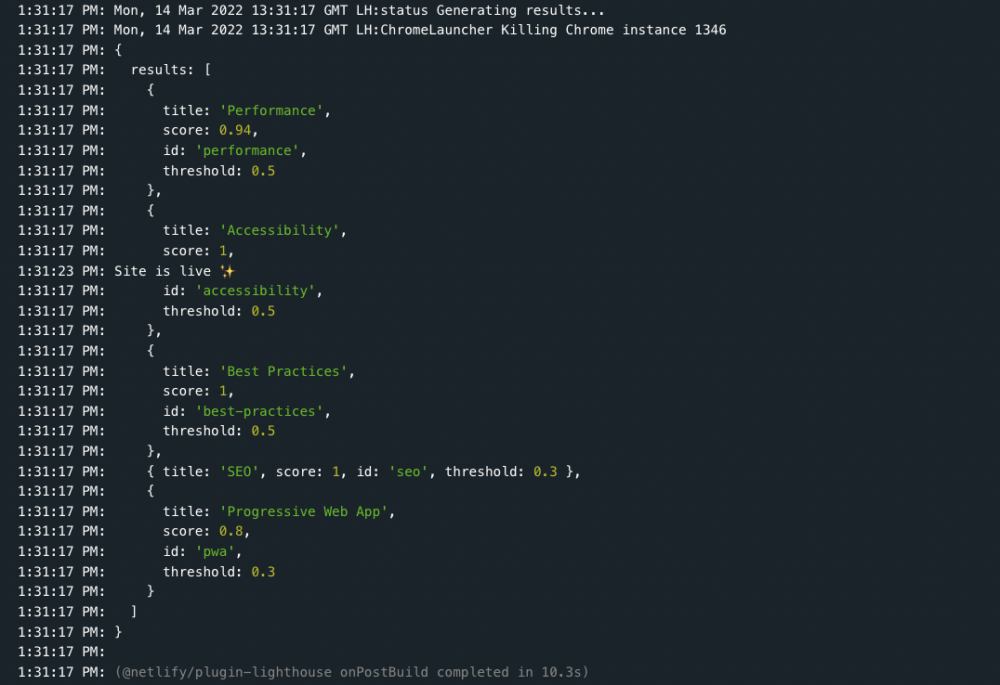
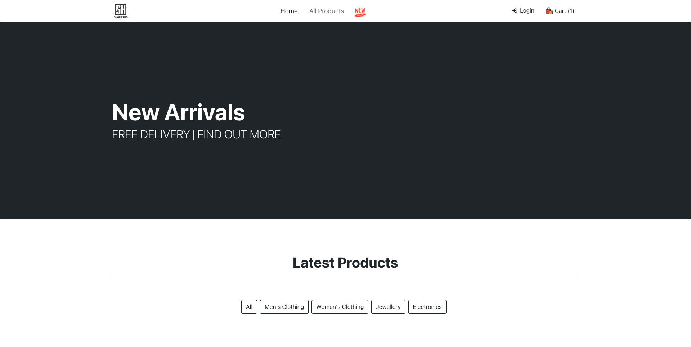

[](https://app.netlify.com/sites/friendly-wescoff-0a9a79/deploys) &nbsp; [](https://deepscan.io/dashboard#view=project&tid=16862&pid=20457&bid=557556)

<br />

# FS-Ecomm 

<p>React, Redux, Bootstrap</p>

<kbd>ON•GOING</kbd>

Fake json api no good. 😧  - need my own node rest api

<br />
<h2>Live link [feature branch]:</h2> 

[Live link - feature branch](https://friendly-wescoff-0a9a79.netlify.app)

<br />



<br />

<h2 align="center">Client</h2>



<br />


<br />


<h2 align="center">Server</h2>

<br />


API end points.  (users, products, auth, cart)


```text
╭─────────────────────┬──────────────────────────────────────────────────────╮
│ METHOD              ┆ DESCRIPTION                                          │
╞═════════════════════╪══════════════════════════════════════════════════════╡
│ GET                 ┆ /products (find all products)                        │
├╌╌╌╌╌╌╌╌╌╌╌╌╌╌╌╌╌╌╌╌╌┼╌╌╌╌╌╌╌╌╌╌╌╌╌╌╌╌╌╌╌╌╌╌╌╌╌╌╌╌╌╌╌╌╌╌╌╌╌╌╌╌╌╌╌╌╌╌╌╌╌╌╌╌╌╌┤
│ POST                ┆ /products (creates a products)                       │
├╌╌╌╌╌╌╌╌╌╌╌╌╌╌╌╌╌╌╌╌╌┼╌╌╌╌╌╌╌╌╌╌╌╌╌╌╌╌╌╌╌╌╌╌╌╌╌╌╌╌╌╌╌╌╌╌╌╌╌╌╌╌╌╌╌╌╌╌╌╌╌╌╌╌╌╌┤
│ GET                 ┆ /products/:id (finds products details)               │
├╌╌╌╌╌╌╌╌╌╌╌╌╌╌╌╌╌╌╌╌╌┼╌╌╌╌╌╌╌╌╌╌╌╌╌╌╌╌╌╌╌╌╌╌╌╌╌╌╌╌╌╌╌╌╌╌╌╌╌╌╌╌╌╌╌╌╌╌╌╌╌╌╌╌╌╌┤
│ DELETE              ┆ /products/:id (deletes a product)                    │
├╌╌╌╌╌╌╌╌╌╌╌╌╌╌╌╌╌╌╌╌╌┼╌╌╌╌╌╌╌╌╌╌╌╌╌╌╌╌╌╌╌╌╌╌╌╌╌╌╌╌╌╌╌╌╌╌╌╌╌╌╌╌╌╌╌╌╌╌╌╌╌╌╌╌╌╌┤
│ PATH                ┆ /products:id (updates a product)                     │          
╰─────────────────────┴──────────────────────────────────────────────────────╯
```

<br /><br />


```data

```


