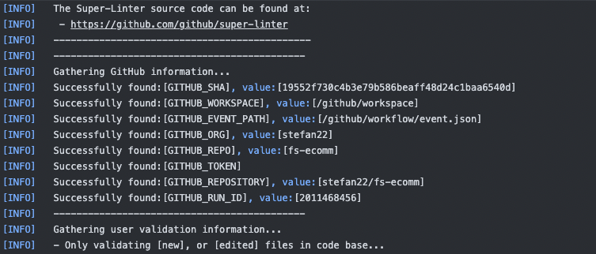

[](https://app.netlify.com/sites/endearing-kelpie-38898e/deploys)
&nbsp;
[](https://deepscan.io/dashboard#view=project&tid=16862&pid=20457&bid=557556)

<br />

# FS-Ecomm

<p>React, Redux, Bootstrap</p>

<kbd>ON•GOING</kbd>

<br />
<h2>Live link [feature branch]:</h2>

[Live link - feature branch](https://endearing-kelpie-38898e.netlify.app/)

<br />


<br />

<h2 align="center">Client</h2>


<br />


<br />

<h2 align="center">Server</h2>

<br />

API end points. (users, products, auth, cart)

```text
╭─────────────────────┬──────────────────────────────────────────────────────╮
│ METHOD              ┆ DESCRIPTION                                          │
╞═════════════════════╪══════════════════════════════════════════════════════╡
│ GET                 ┆ /products (find all products)                        │
├╌╌╌╌╌╌╌╌╌╌╌╌╌╌╌╌╌╌╌╌╌┼╌╌╌╌╌╌╌╌╌╌╌╌╌╌╌╌╌╌╌╌╌╌╌╌╌╌╌╌╌╌╌╌╌╌╌╌╌╌╌╌╌╌╌╌╌╌╌╌╌╌╌╌╌╌┤
│ POST                ┆ /products (creates a products)                       │
├╌╌╌╌╌╌╌╌╌╌╌╌╌╌╌╌╌╌╌╌╌┼╌╌╌╌╌╌╌╌╌╌╌╌╌╌╌╌╌╌╌╌╌╌╌╌╌╌╌╌╌╌╌╌╌╌╌╌╌╌╌╌╌╌╌╌╌╌╌╌╌╌╌╌╌╌┤
│ GET                 ┆ /products/:id (finds products details)               │
├╌╌╌╌╌╌╌╌╌╌╌╌╌╌╌╌╌╌╌╌╌┼╌╌╌╌╌╌╌╌╌╌╌╌╌╌╌╌╌╌╌╌╌╌╌╌╌╌╌╌╌╌╌╌╌╌╌╌╌╌╌╌╌╌╌╌╌╌╌╌╌╌╌╌╌╌┤
│ DELETE              ┆ /products/:id (deletes a product)                    │
├╌╌╌╌╌╌╌╌╌╌╌╌╌╌╌╌╌╌╌╌╌┼╌╌╌╌╌╌╌╌╌╌╌╌╌╌╌╌╌╌╌╌╌╌╌╌╌╌╌╌╌╌╌╌╌╌╌╌╌╌╌╌╌╌╌╌╌╌╌╌╌╌╌╌╌╌┤
│ PATH                ┆ /products:id (updates a product)                     │
╰─────────────────────┴──────────────────────────────────────────────────────╯
```

<br /><br />



```data

```
