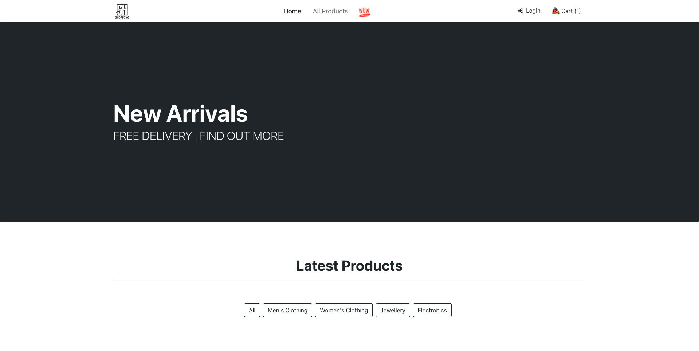
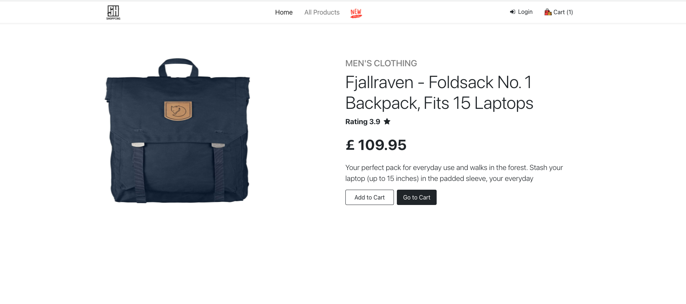

# FS-Ecomm 

<p>React, Redux, Bootstrap</p>

<kbd>ongoing</kbd>


<br />

<h2 align="center">Client</h2>



<br />




<br />


<h2 align="center">Server</h2>

<br />


API end points.  (users, products, auth, cart)


```text
╭─────────────────────┬──────────────────────────────────────────────────────╮
│ METHOD              ┆ DESCRIPTION                                          │
╞═════════════════════╪══════════════════════════════════════════════════════╡
│ GET                 ┆ /products (find all products)                        │
├╌╌╌╌╌╌╌╌╌╌╌╌╌╌╌╌╌╌╌╌╌┼╌╌╌╌╌╌╌╌╌╌╌╌╌╌╌╌╌╌╌╌╌╌╌╌╌╌╌╌╌╌╌╌╌╌╌╌╌╌╌╌╌╌╌╌╌╌╌╌╌╌╌╌╌╌┤
│ POST                ┆ /products (creates a products)                       │
├╌╌╌╌╌╌╌╌╌╌╌╌╌╌╌╌╌╌╌╌╌┼╌╌╌╌╌╌╌╌╌╌╌╌╌╌╌╌╌╌╌╌╌╌╌╌╌╌╌╌╌╌╌╌╌╌╌╌╌╌╌╌╌╌╌╌╌╌╌╌╌╌╌╌╌╌┤
│ GET                 ┆ /products/:id (finds products details)               │
├╌╌╌╌╌╌╌╌╌╌╌╌╌╌╌╌╌╌╌╌╌┼╌╌╌╌╌╌╌╌╌╌╌╌╌╌╌╌╌╌╌╌╌╌╌╌╌╌╌╌╌╌╌╌╌╌╌╌╌╌╌╌╌╌╌╌╌╌╌╌╌╌╌╌╌╌┤
│ DELETE              ┆ /products/:id (deletes a product)                    │
├╌╌╌╌╌╌╌╌╌╌╌╌╌╌╌╌╌╌╌╌╌┼╌╌╌╌╌╌╌╌╌╌╌╌╌╌╌╌╌╌╌╌╌╌╌╌╌╌╌╌╌╌╌╌╌╌╌╌╌╌╌╌╌╌╌╌╌╌╌╌╌╌╌╌╌╌┤
│ PATH                ┆ /products:id (updates a product)                     │          
╰─────────────────────┴──────────────────────────────────────────────────────╯
```

<br /><br />


```data

 Fear none todo 😲

 Fetching data off fake json api service but to put together a firestore rest api/ or monogdb (& generate docs)
 Authentication/authorisation: own and third party apps like google service
 Leaving fun stuff for later: gsap animations/svgs
 Css w css modules/ theme - main stuff w/bootstrap
 Looking good so far - will deploy to netlify or firebase hosting
 Devops workflow
 Shopping cart integration: strapi? haha enough already!
 ...
 ...
 
```


