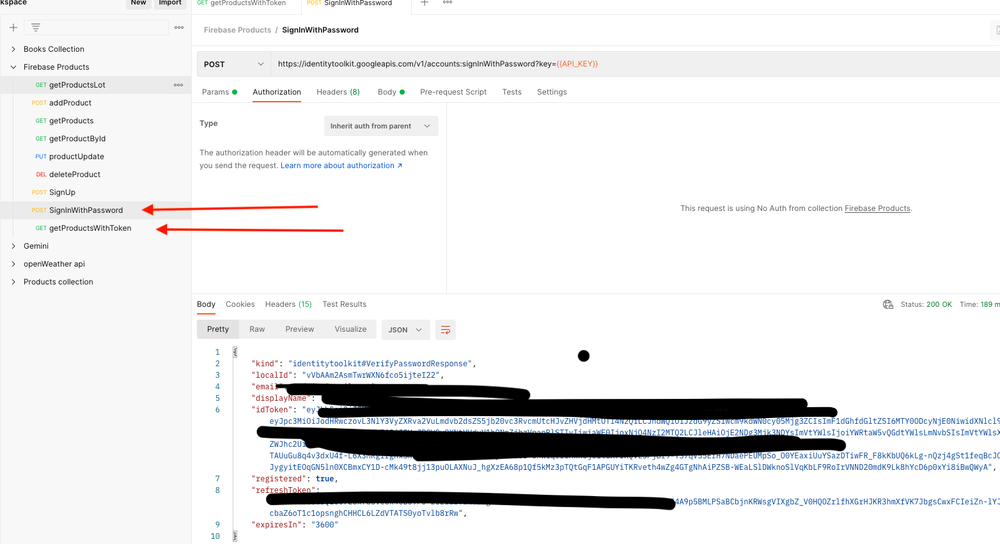

<br />

<h2 "text-align:center"> Cloud Function Auth Endpoint  &nbsp;  🌨️   🌧️  &nbsp; </h2>


####  &nbsp;   <kbd><h3>:fire: Firebase Cloud function</h3></kbd>


- Passes email/password (user pre-config in Firebase/Firestore DB) then 
- Bearer token to access products at at [auth]/products endpoint


<br />

####  &nbsp; <kbd><h3>About using a Google cloud Function for your dummy data   😶‍🌫️</h3></kbd>   &nbsp;


- So while it all works fine with React....along with localStorage (for persisting state), and it is a free Google service - 50k requests/day.

- Fact remains, there's really no way no protect web-api keys nor the email and passwords + tokens (that I'm aware of) in React and if they were to get
stolen, who knows what could happen So I wouldn't recommend it for a Github project. 

- I realized this, as I was fixing a branch merging conflict, that I had inadvertently pushed my ***.env*** file.  
Although, I deleted it right away, even as far as getting rid of GIT cache/ past-history etc.  It still wasn't enough, when you take into account 
that Google Dev tools is capable to supply you with a brand new, nicely formatted copy of all your .env vars  regardless of whether you've included
them in your ***.gitignore*** file or not.  &nbsp;  ___<kbd>``` ( source > static > main.js bundle ) ```</kbd>___

- Taking the fetching `products` function out of the front-end probably best here.


<br />

<p>

That was fun. 😨 

  </p>

<br />
<br />



